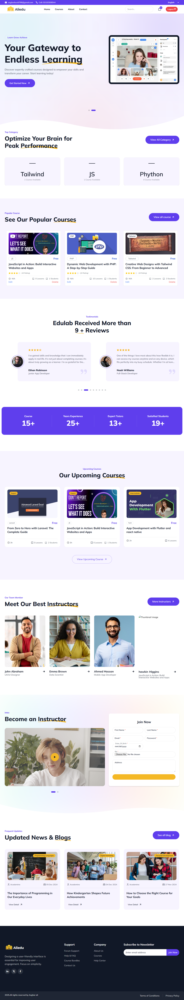
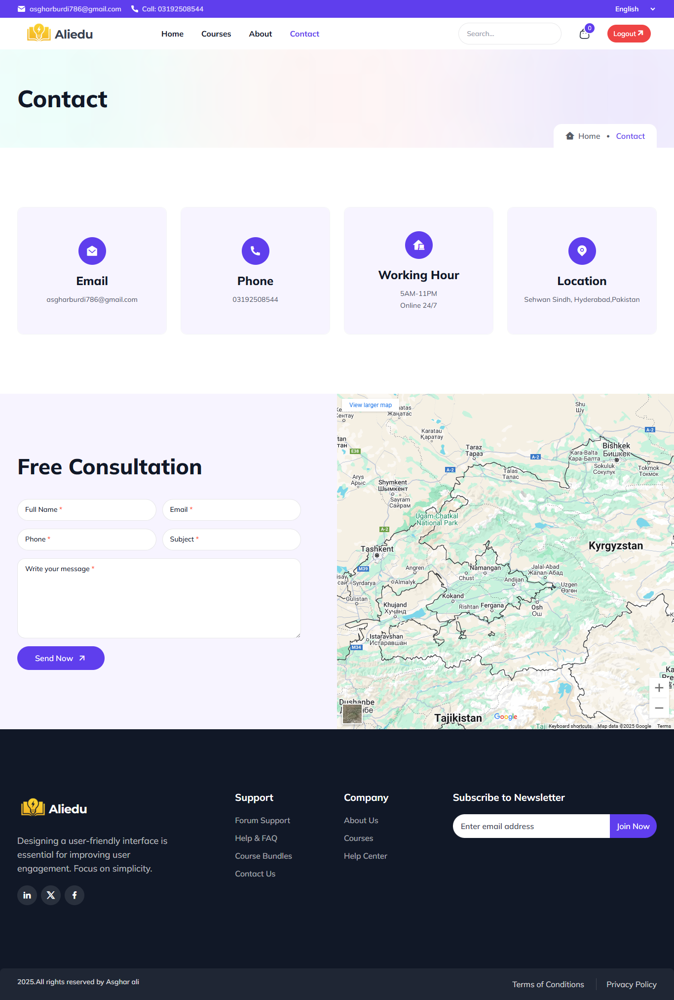
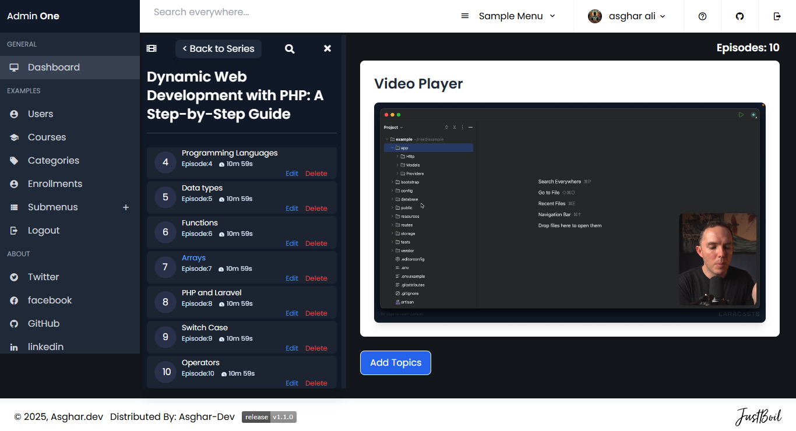

# Learning Management System


---

## Templates Preview

<details open="true"><summary><strong>Homepage</strong></summary><br>

</details>

<details><summary><strong>About</strong></summary><br>

</details>

<details><summary><strong>Contact </strong></summary><br>

</details>

<details><summary><strong>Dashboard</strong></summary><br>

</details>

## Overview

The **Learning Management System (LMS)** is a web-based platform designed to offer free courses with role-based access. It simplifies course management, enrollment, and user interactions.

---

## Features

-   **Admin Panel**: Full control over users, courses, and enrollments.
-   **Teacher Role**: Access all courses, enroll students, and manage content.
-   **Student Role**: Enroll in one free course, view lessons, and track progress.
-   **Responsive Design**: Works smoothly on desktops, tablets, and mobile devices.
-   **Authentication**: Secure login for admins, teachers, and students.

---

## Technologies Used

-   **Frontend**: Tailwind CSS, Alpine.js
-   **Backend**: PHP
-   **Database**: MySQL

---

## Installation

### Steps to Set Up the Project:

1. **Clone the Repository**:

    ```bash
    git clone https://github.com/asgharali101/final-project
    cd learning-management-system
    ```

2. **Run the Server**:
   Start your local development server:

    ```bash
    php -S localhost:8000
    ```

3. **Access the System**:
   Open your browser and visit:
    ```
    http://localhost:8000
    ```

---

## User Roles

1. **Admin**:

    - Full access to manage users, courses, and enrollments.

2. **Teacher**:

    - View all courses.
    - Enroll students in any course.

3. **Student**:
    - Enroll in one free course.
    - Access course content.

---

## Contributing

Pull requests are welcome! For significant changes, please open an issue first to discuss what you’d like to change.

---

---

## Contact

For questions or collaboration, reach out at:(mailto:asgharburdi786@gmail.com)

### Steps

1. **Clone the Repository**:
    ```bash
    git clone https://github.com/your-username/school-management-system.git
    cd school-management-system
    ```
